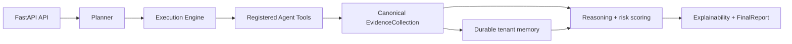

# Email Analysis Agent

Email Analysis Agent is a typed, evidence-driven platform for investigating suspicious email. It combines parsing, sender/URL/attachment analysis, OCR and QR inspection, optional threat intelligence, durable investigation memory, campaign correlation, weighted risk scoring, and explainable reports.

## Architecture



## Features

- Sender authentication and infrastructure observations
- URL, attachment, OCR, QR, and optional threat-intelligence enrichment
- Tenant-isolated durable memory and historical/campaign correlation
- Canonical evidence with explainable weighted risk contributions
- FastAPI authentication, RBAC, audit records, correlation IDs, health, and metrics
- JSON, Markdown, and HTML report renderers

## Quick start

Python 3.13+ is required.

```bash
python -m pip install -e ".[dev]"
python -m pytest
python -m ruff check .
python -m mypy src
uvicorn src.api.main:app --reload
```

Set required production secrets before starting the API. See [configuration](docs/configuration.md) and [deployment](docs/deployment.md).

## API example

```bash
curl -X POST http://localhost:8000/api/v1/investigate \
  -H "Authorization: Bearer <token>" \
  -H "Content-Type: application/json" \
  -d '{"subject":"Urgent payment","sender":"billing@example.test","body":"Review https://example.test"}'
```

The response contains classification, confidence, risk level, and the complete structured report.

## Project layout

```text
src/api/                       HTTP API, authentication, RBAC
src/analyzers/agent/           tools, registry, evidence adapters
src/security_intelligence/     OCR, QR, IOC, campaign, threat-intel services
src/memory/                    retrieval, learning, vector storage
src/planner/                   planning, reasoning, scoring, reports
docs/                          architecture and operational documentation
tests/                         unit and integration coverage
```

## Documentation

- [Architecture](docs/architecture.md)
- [API guide](docs/api.md)
- [Configuration](docs/configuration.md)
- [Deployment and operations](docs/deployment.md)
- [Developer guide](docs/development.md)
- [Troubleshooting](docs/troubleshooting.md)
- [Security policy](SECURITY.md)
- [Release notes](CHANGELOG.md)

## Contributing and license

See [CONTRIBUTING.md](CONTRIBUTING.md). This project is released under the [MIT License](LICENSE).
